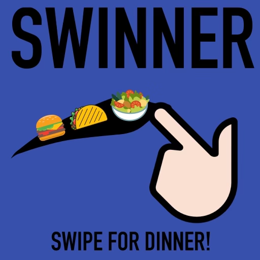
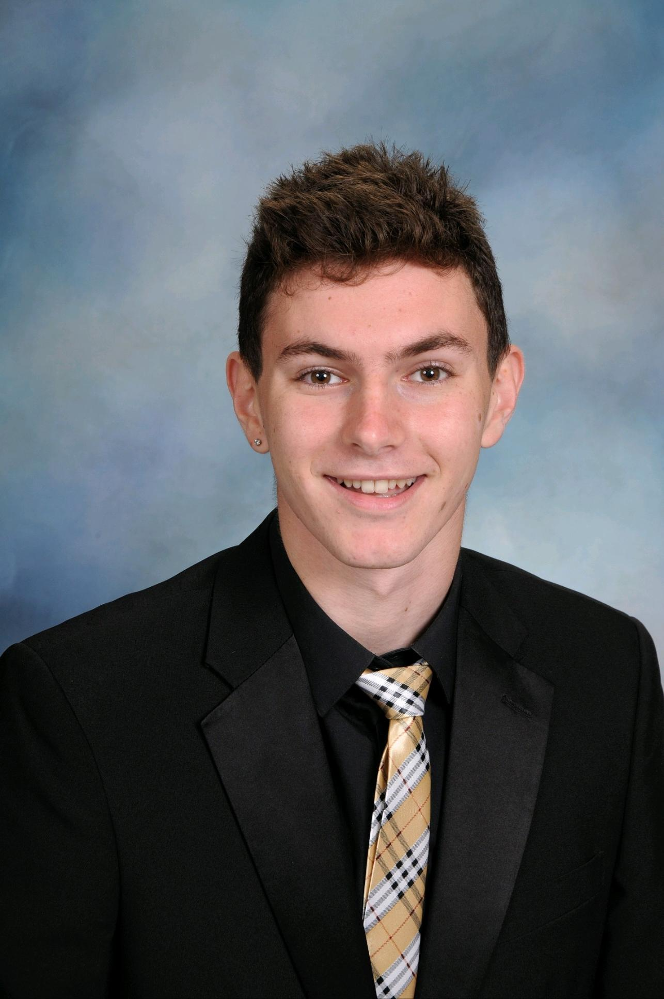
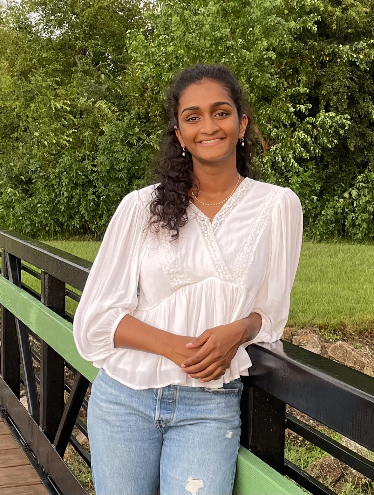

 

  
  
   
   

  

    An Android app developed for HACKRICE 12
     
    <a href="https://github.com/andrewalufkin/HackRice12-swinner"><strong>Explore the code »</strong></a>
     
     
    <a href="https://docs.google.com/document/d/1J_POwiH8UCxaDlHuHGAQRubZw9qrckL-QawmZjxV_p4/edit">Hacker Handbook</a>
    ·
    <a href="https://hack.mlh.io/prizes">MLH</a>
  

<!-- TABLE OF CONTENTS -->

  
Table of Contents

  <ol>
    <li><a href="#team">Team</a></li>
    <li><a href="#about-the-project">About The Project</a></li>
    <li><a href="#our-vision">Our Vision</a></li>
    <li><a href="#acknowledgments">Acknowledgments</a></li>
  </ol>

<!-- TEAM -->
## Team

  

  <h3 align="left">Michael Khalfin</h3>

  

    Michael is a freshman studying Operations Research at Rice University. He was born and raised in New York. He is passionate about applying mathematics to real-world problems. When not working, he enjoys swimming, listening to music, cycling on local trails, and hiking. Learn more about Michael on his <a href="https://michael-khalfin.github.io/michael-khalfin-cv/">website</a>.
  

 

  

  <h3 align="left">Andrew Adams</h3>

  

    Andrew is a junior studying Computer Science at Rice University. he was born and raised in Texas. He is passionate about working together with people to solve complicated problems. When not working, he enjoys playing Super Smash Bros, reading everything and anything, and spending time with friends.
  

 
  

  

  <h3 align="left">Teon Golden</h3>

  

    Teon is a freshman studying Computer Science at Rice University. he was born and raised in Texas. He is passionate about artifical general intelligence and its implications. When not working, he enjoys reading novels, watching documentaries, and eating icecream.
  

 
  

  

  <h3 align="left">Ananya Rao</h3>

  

    Ananya is a freshman studying Computer Science at Rice University. She was born in Virginia and raised in Texas. She is passionate about using technology to improve healthcare. When not working, she enjoys going on long runs, reading trashy romance books, and hanging out with friends.
  

<!-- ABOUT THE PROJECT -->
## About The Project

  

    Fact: Corporate workers with children are <strong>BUSY</strong>.
  

  

    Fact: Professionals struggle with meal planning because they lack <strong>TIME</strong>.
  

  

    Fact: Meal planning should be <strong>AUTOMATED</strong>.
  

  

    Enter Swinners, an Android app to make meal planning easier than ever. After downloading the app and creating a free account, users are greeted with some preliminary questions:
    <ol>
      <li>What is your planned budget per meal?</li>
      <li>Do you have any dietary restrictions and/or allergies?</li>
      <li>Which cuisines do you like?</li>
      <li>How much time are you able to dedicate to cooking?</li>
    </ol>
    After establishing some basic parameters, users get access to thousands upon thousands of curated recipes. They swipe right or left to "favorite" or "skip" a recipe. Users can view directions to cook their favorite recipes, or even check out the ingredients to be delivered to their door.
  

  

    Winner, winner, chicken, swinner.
  

<!-- OUR VISION -->
## Our Vision

  

    We developed Swinner for the First Timers Track during HACKRICE 12. We focused on creating robust algorithms and good UI / UX during our time hacking. In the future, machine learning can improve the user experience tenfold, bringing them closer and closer to the perfect dinner. We hope you are as excited about our product as we are!
  

<!-- ACKNOWLEDGMENTS -->
## Acknowledgments

  

    We would like to thank HACKRICE 12, Rice University, and all the sponsors for this wonderful opportunity and experience. Although this was our first Hackathon, it will not be our last. There is no feeling more rewarding than creating a practical and functioning product to help people in their daily lives.
  

  

    We would also like to thank our friends, parents, family, mentors, and professors for their unwavering support of our endeavors. We are eternally grateful.
  

